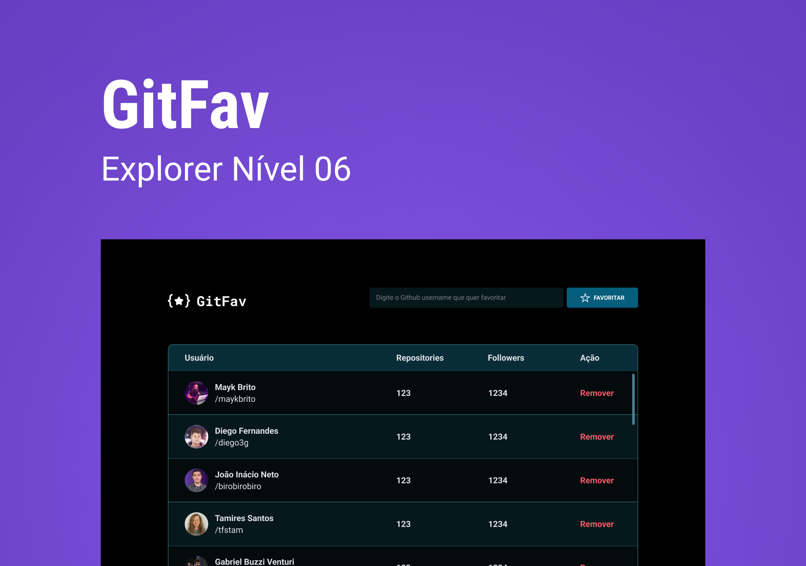

<h1 align="center"> GIT Favorites 2.0 </h1>

Projeto promovido pelo curso Explorer da Rocketseat para ensino de tecnologias WEB.  
<a href="https://app.rocketseat.com.br/node/stage-06" target="_blank">Estude esse projeto em formato de vídeo clicando aqui.</a>

  <a href="#-tecnologias">Tecnologias</a>&nbsp;&nbsp;&nbsp;|&nbsp;&nbsp;&nbsp;
  <a href="#-projeto">Projeto</a>&nbsp;&nbsp;&nbsp;|&nbsp;&nbsp;&nbsp;
  <a href="#-layout">Layout</a>&nbsp;&nbsp;&nbsp;|&nbsp;&nbsp;&nbsp;
  <a href="#memo-licença">Licença</a>

  

 

  

## 🚀 Tecnologias

Esse projeto foi desenvolvido com as seguintes tecnologias:

- HTML e CSS
- JavaScript
- Git e Github
- Figma

## 💻 Projeto

O GitFavs é um projeto desenvolvido no stage 6 do Explorer. Por meio de uma API do Github podemos adicionar ao sistema 
usuários do github.com e utilizando o localStorage conservamos o cache atualizado ao recarregar a página.

- [Acesse o projeto finalizado, online](https://luhc011.github.io/Git-Fav-2.0/)

## 🔖 Layout

Você pode visualizar o layout do projeto através [DESSE LINK](https://www.figma.com/file/Cwv99K79ddIoiaczPwXSWz/%5BDesafios-Explorer%5D-GitFav-(Copy)-(Copy)?node-id=104%3A48&t=5HJOfx0GGlGt1mq7-1). É necessário ter conta no [Figma](https://figma.com) para acessá-lo.

## :memo: Licença

Esse projeto está sob a licença MIT.

---

Contato ♥ :wave: 

  <a href="https://www.linkedin.com/feed/"  target="_blank">LinkedIn</a>&nbsp;&nbsp;&nbsp;|&nbsp;&nbsp;&nbsp;
  <a href="https://www.instagram.com/holandaa_lucaas/" target="_blank">Instagram</a>&nbsp;&nbsp;&nbsp;|&nbsp;&nbsp;&nbsp;
  <a href="mailto:lucashcardoso26@gmail.com">Email</a>

